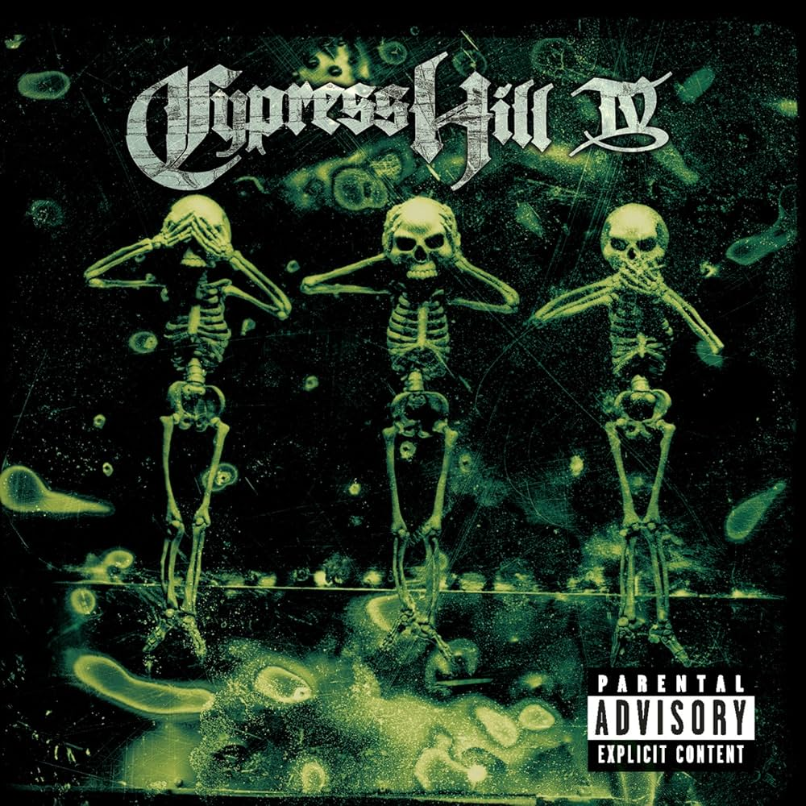
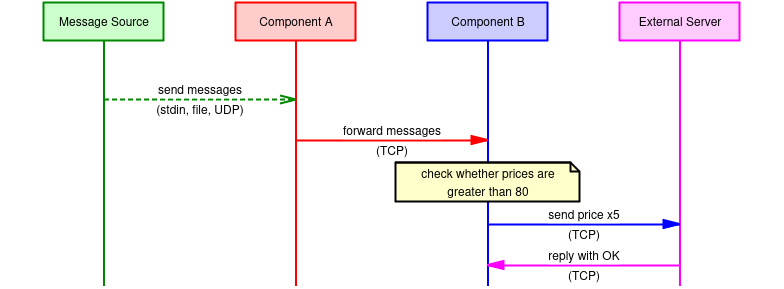
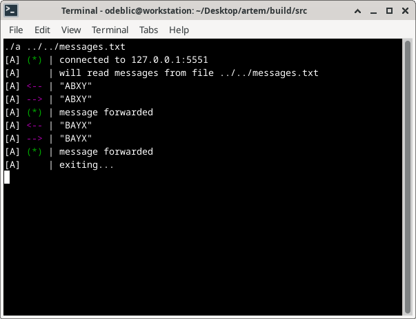
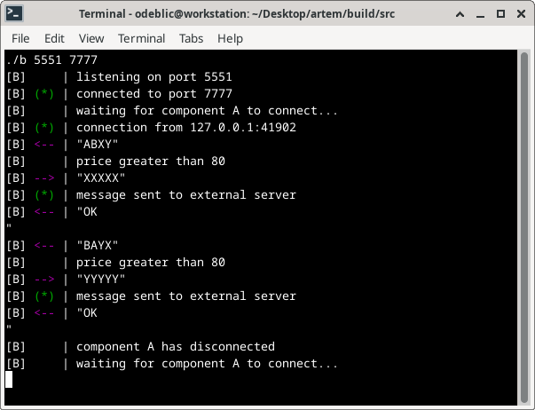
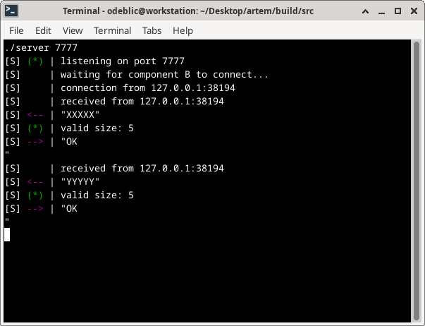

# The Cyprus Hill Project

Because naming matters, because it is cool, because we have fun coding.



## Requirements

Your task is to implement two software components.

**Component A** is receiving messages that contain a number of the following entries:

```cpp
struct Entry
{
  unsigned char price;
  unsigned char volume;
};
```

After `N` number of entries there is a line delimiter `\n` closing the message. So an incoming message with 2 entries may look like:

| offset    | 0  | 1  | 2  | 3  | 4   |
| --------- | -- | -- | -- | -- | --- |
| field     | p  | v  | p  | v  | END |
| decimal   | 65 | 66 | 88 | 89 | 10  |
| character | A  | B  | X  | Y  | \n  |

**Component A** is responsible for passing these entries to **Component B**. How you implement **Component A** and **Component B** and the communication between them is up to you.

**Component B** processes incoming messages from **Component A**. If the price in the entry is higher than `80`, **Component B** sends a message to the external **Server**. The message has a fixed 5 bytes length each byte repeating the price (eg. `88 88 88 88 88`). **Component B** also prints out messages it receives from the external **Server**.

The reaction of **Component B** to **Component A**'s input should be fast and they should run decoupled, ie processing done by **Component B** should not block **Component A** receiving messages.

`[msg with Entries] -> [A] -> [B] <-> [Server]`

First you may implement the input to **Component A** as reading from `stdin`, and the output reaction of **Component B** as printing to `stdout` while also listening for incoming `stdin` messages.

After `stdin`/`stdout` (or even instead) try implementing the incoming messages to **Component A** as UDP packets and the outgoing/incoming messages of **Component B** as a TCP connection. You can use Netcat to send UDP messages to **Component A** and also to run a TCP server that **Component B** connects to.

Solve as much of the task you feel comfortable with while having fun.

Use CMake and modern C++ on a UNIX OS (Mac OS/Linux).

## Disclaimer

You are in looking at a relatively well-designed project,
with a big effort to be clear and reader-friendly.

However, it is not considered really finished.
There are still a lot of `TODOs` in the source code!

Still, it is a good base to demonstrate the concept.

To be iterated...

## Project layout

```
.
|-- CMakeLists.txt
|-- images
|   |-- component-a.png
|   |-- component-b.png
|   |-- external-server.png
|   `-- workflow.png
|-- LICENSE.txt
|-- messages.txt
|-- README.md
|-- src
|   |-- a.cpp
|   |-- b.cpp
|   |-- CMakeLists.txt
|   |-- server.cpp
|   `-- utils
|       |-- Address.hpp
|       |-- Arguments.hpp
|       |-- Buffer.hpp
|       |-- Console.hpp
|       |-- Errors.hpp
|       |-- File.hpp
|       |-- Message.hpp
|       |-- Network.hpp
|       `-- Socket.hpp
`-- workflow.msc
```

## Technical overview

_Components:_

1. The **Message Source**
1. The **Component A**
2. The **Component B**
3. The **External Server**

_Workflow:_



## Usage

How to clone and build:

```sh
git clone https://github.com/odeblic/cyprus-hill.git
cd cyprus-hill
mkdir build
cd build
cmake ..
make
```

How to test and run:

```sh
# run component A, reading messages from stdin
build/src/a

# run component A, reading messages from file
build/src/a messages.txt

# run component A, reading messages from network
build/src/a 5555

# run component B, listening on port 5555 and forwarding to port 7777
build/src/b 5555 7777

# run external server, listening on port 7777
build/src/server 7777
```

Note that only ports are specified, not hosts. Messages are
exchanged exclusively on the loopback interface for simplicity.

## Screenshots

Component A:



Component B:



External Server:



## License

All the content of this repository is under AGPL license.

Please check carefully the terms in the `LICENSE.txt` file.

## Author

For any question, please contact the author: [Olivier de BLIC](mailto:odeblic@gmail.com).
